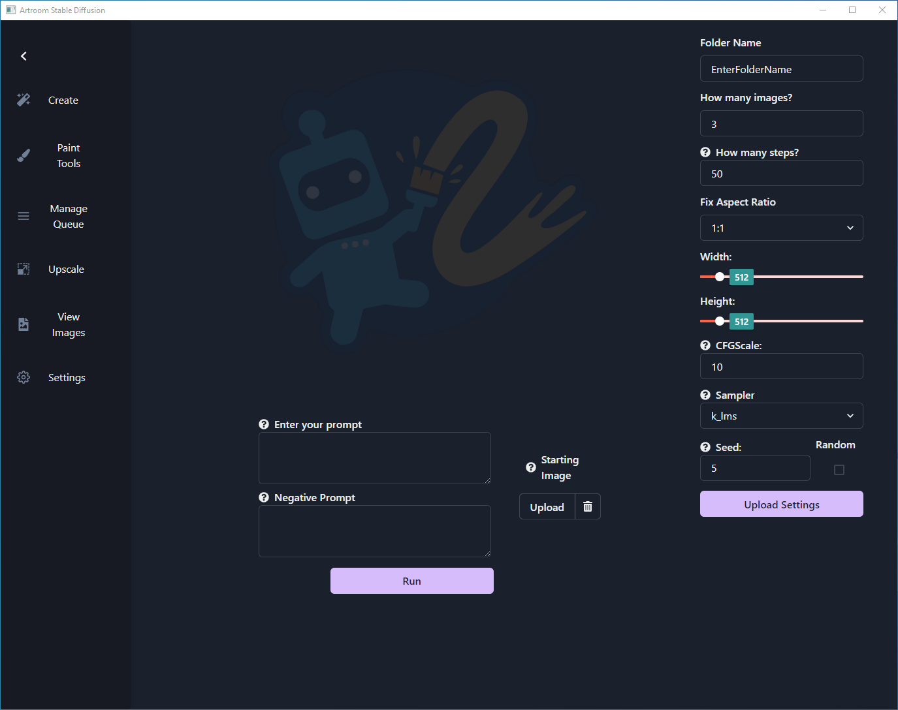

# Artroom

## Menu Options
- **[Create](create.md)**

	Create your text prompts and change settings for image generation.

- **[Paint Tools](paint_tools.md)**

	Like `Create` but with additional editing tools to allow for using edited pictures

- **[Manage Queue](manage_queue.md)**

	See all your queued jobs from `Create` and `Paint Tools`.

- **[Upscale](upscale.md)**

	Easily upscale images without the need for external tools.

- **[Settings](settings.md)**

	Change your model configuration or hardware settings.