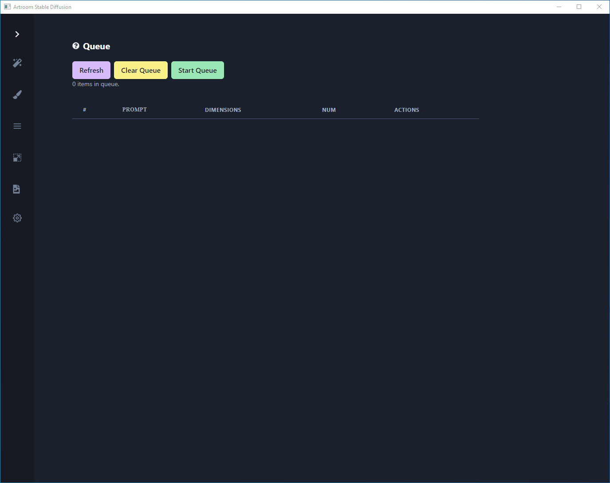

# Manage Queue

## Queue

- **Refresh**

	Refresh your queue view if jobs aren't populating.

- **Clear Queue**

	Remove old jobs from the queue.

- **Start Queue**

	Currently queued jobs can be started and stopped as needed.