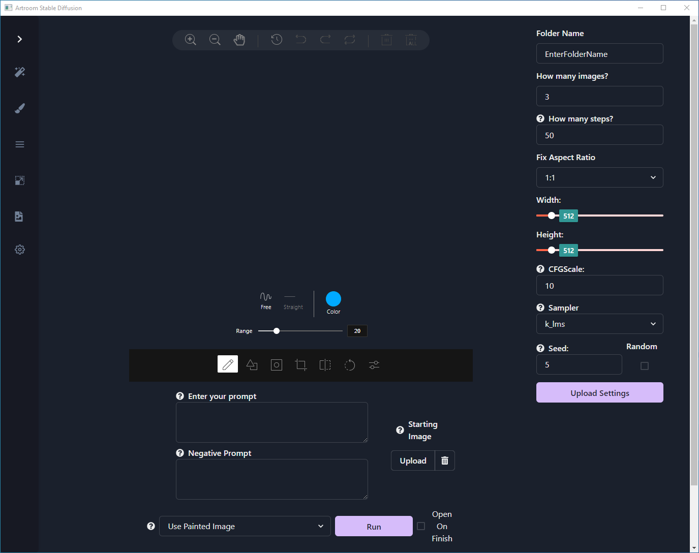

# Paint Tools

## Options
- **Draw**

	Draw lines using the `Free` or `Straight` line tools.  Brush thickness can be selected with `Range`, and `Color` brings up a preset of colors as well as a color picker.
- **Shape**

	Choose between `Rectangle`, `Circle`, and `Triangle`.  `Fill` and `Stroke` colors can be changed along with `Stroke` size.
- **Mask**

	Select a mask image from your files using `Load Mask Image`.  `Apply` will add your selected image as an overlay transparency.
- **Crop**

	Crop your image to a preset aspect ratio or a custom size.
- **Flip**

	Flip the image along the X or Y axis.
- **Rotate**

	Rotate your image in 30 degree increments or a custom range.
- **Filter**

	Apply a number of different filters to change color, lighting, pixelation, and other aspects of the image.