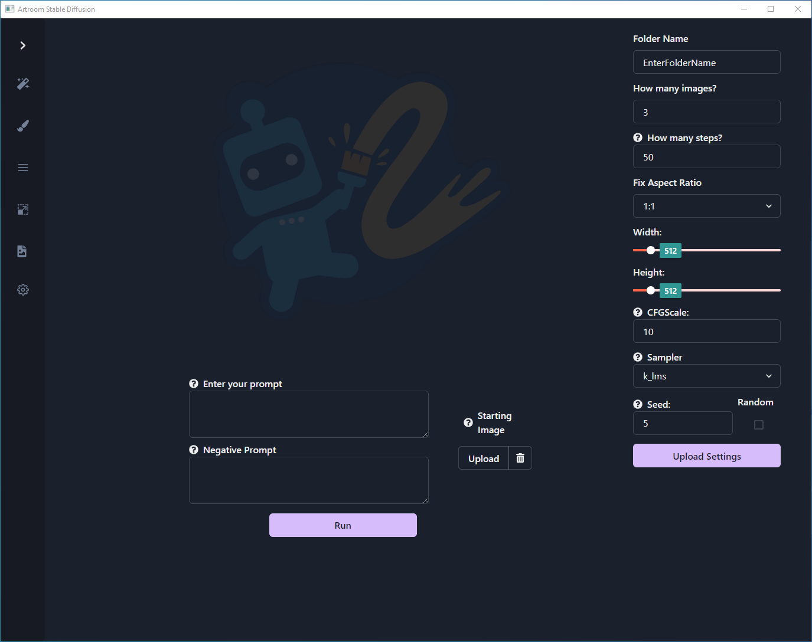

# Create

## Run

- **Run**

	Start your image generation.  Runs will be stored in `Manage Queue`.

- **Enter your prompt**

	Write what you want to generate.

- **Negative Prompt**

	Write what you don't want to show up in your generated image.
	Here's a good default:
	```
	text,crop,jpeg,artifacts,signature,watermark,blurry
	```

- **Starting Image**

	`Upload` any image from your file system.  This can be used in conjunction with the text prompt.

### Upload Settings

- **Upload Settings**

	Settings will be saved on each `Run` to `settings.json`.  Upload previous settings to new runs.

- **Folder Name**

	Name the directory where your files will be placed.  Destination can be changed in `Settings`.

- **How many images**

	Select the number of images to generate when starting `Run`.

- **How many steps**

	Determine the number of steps the generator will take per image.  It is generally less useful to run past 100 steps, so 50 is a good default.

- **Fix Aspect Ratio**

	Sets the aspect ratio of the generated images.  There are several presets as well as the ability to set a custom aspect ratio.

- **Width & Height**

	Shows the size selected from `Fix Aspect Ratio`.  Enter your desired size in pixels when using custom.

- **CFGSCale**

	Affects the intensity of the generations.  A usual default is between 5-15.

- **Sampler**

	Choose the sampler Stable Diffusion will use.  This will change the results of generation.

- **Seed**

	Controls the randomness of image generation.  Using a preset seed will cause the same results each time, so toggle `Random` to get a new random seed each time.