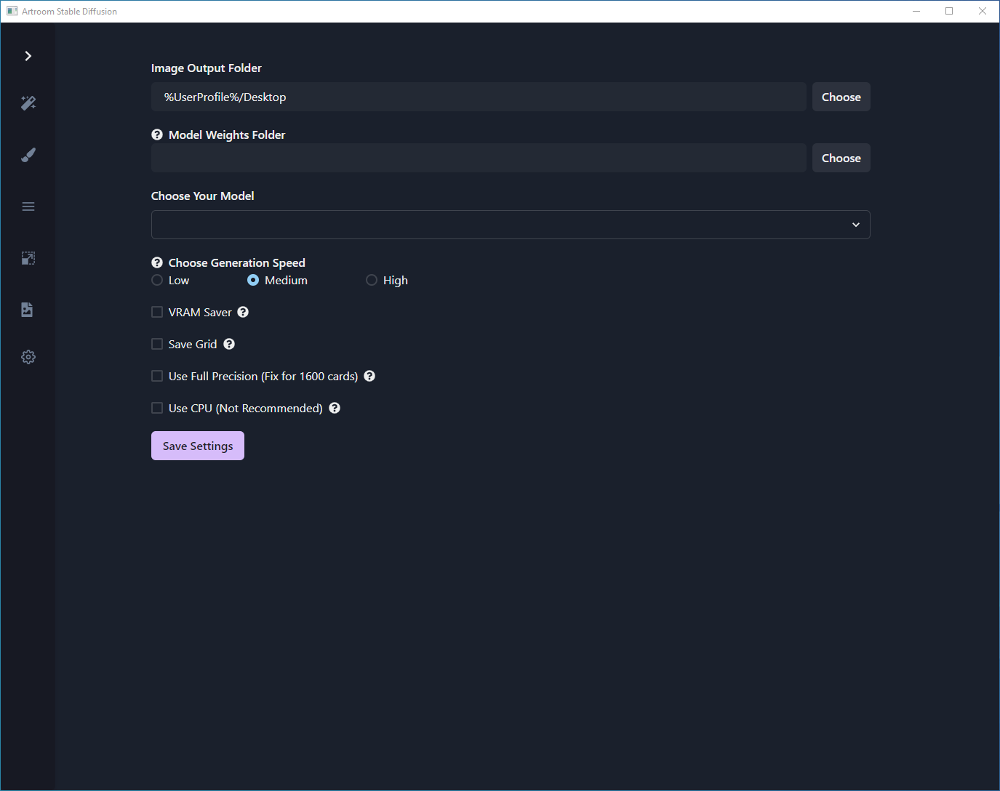

# Settings

## Settings

- **Image Output Folder**

	Destination for generated images.

- **Model Weight Folder**

	Destination to save model weights.

- **Choose Your Model**

	Select a model from your saved model weights.

- **VRAM Saver**

	Slows down image generation to allow for larger images to fit on the GPU memory.

- **Save Grid**

	Save your batch of images into one grid.

- **Use Full Precision**

	Fix option for 1660 Nvidia GPUs.

- **Use CPU**

	Use CPU to generate images.  Not recommended if you already have a GPU, but this option will allow for users without a discrete GPU to create images.