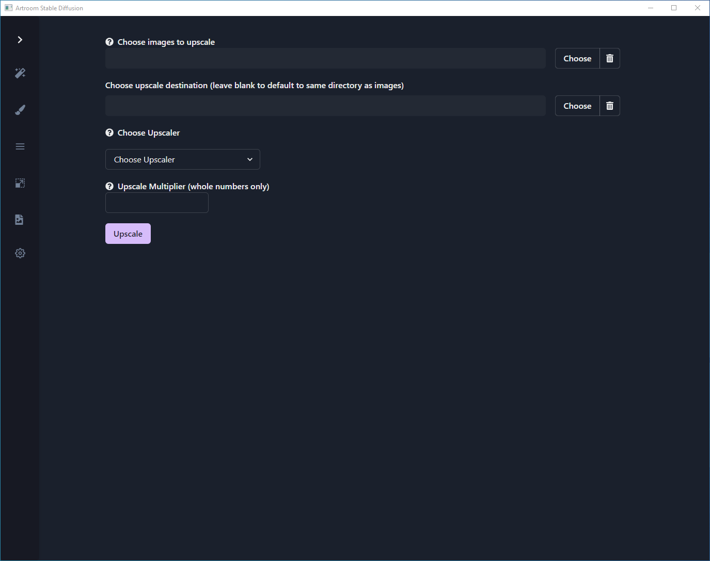

# Upscale

## Upscale

- **Choose images to upscale**

	Upscale a single image or a batch of images.

- **Choose upscale destination**

	Set up a directory to send your upscale results.

- **Choose Upscaler**

	Select from a number of different upscalers. Some will work better with certain types of images.

- **Upscale Multiplier**

	Multiply the size of height & width by an integer.
